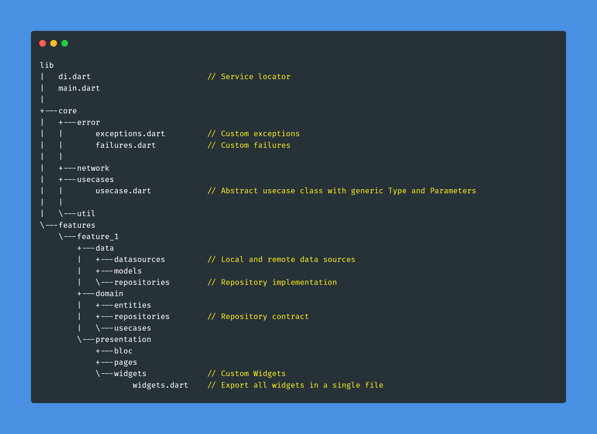

# Flutter Clean Architecture Template

A Flutter Template for implementing Clean Architecture with Test Driven Development.

### Folder Structure

This Template is created from the project structure of [Clean Architecture with TDD series](https://www.youtube.com/playlist?list=PLB6lc7nQ1n4iYGE_khpXRdJkJEp9WOech) on YouTube by [Reso Coder](https://resocoder.com)
